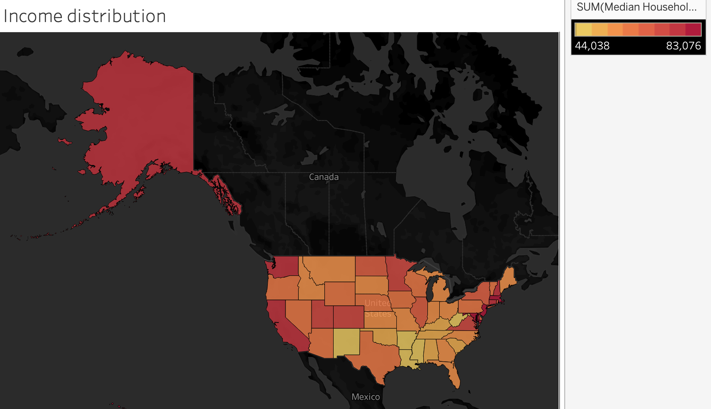
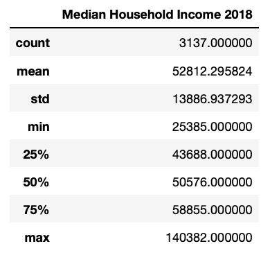
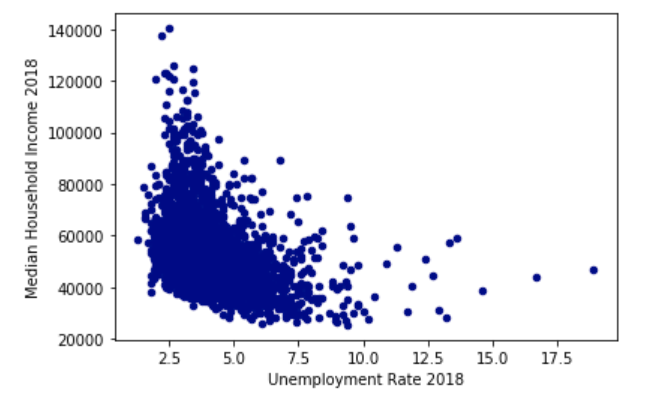
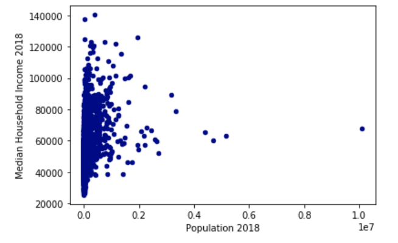
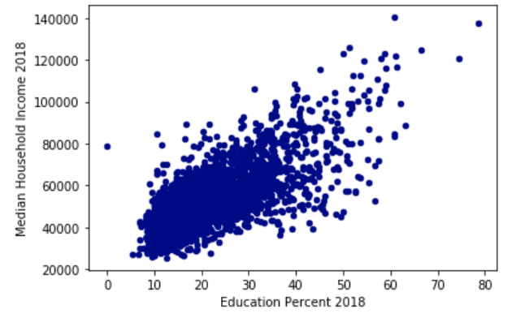
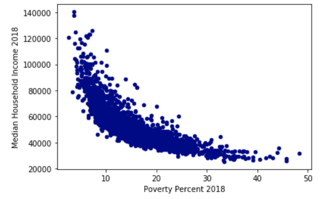
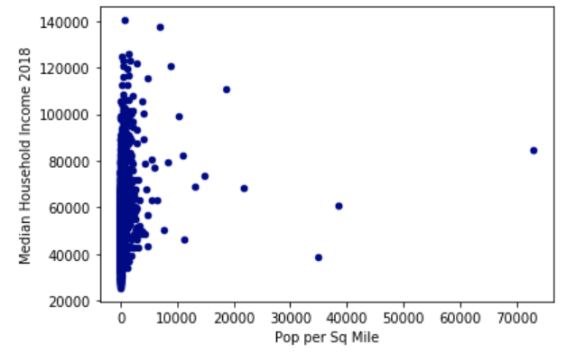
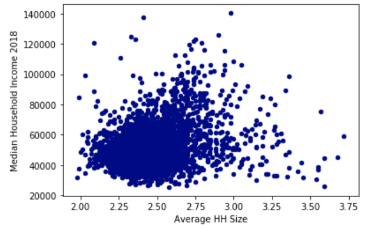
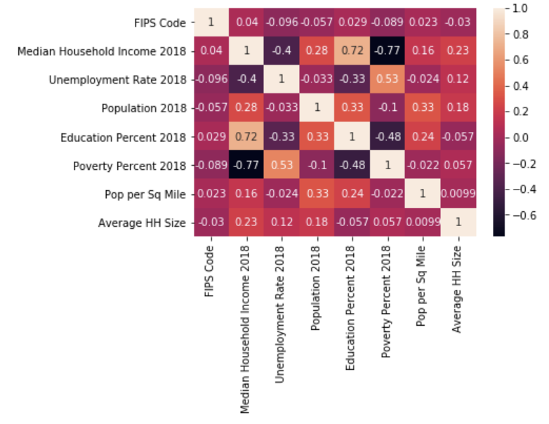
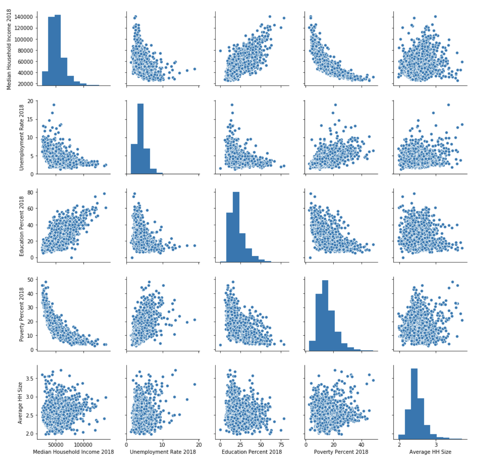

# Final Project Submission - Team Plotly

## Topic

What do we hope to achieve?
Utilizing the County level census data, we want to determine how household income is distributed based on geographic location. We will be then try to identify what factors affect the disparity and if we can predict the average incomes in the future.

Reason Why?
Census data has great quality of data and openly available.  By comparing and contrasting data by county we want to dive in and verify differences in variable factors that may contribute to poverty or lower income.

Description of the source data
Four tables by County level for poverty, population, unemployment / Median Household Income, and Education  (https://www.ers.usda.gov/data-products/county-level-data-sets/)

Questions we hope to answer with the data:
1) Is there an income disparity?
2) What are the factors affecting the income disparity?
3) Can we predict income based on these factors?

## GitHub

1. Master Branch created and all team members have joined
2. Description of communication protocols
  - Meeting on Wednesday during course breakout rooms
  - Mostly online and shared personal communication (email)
  - Slack channel setup with team members
  - Notifications on each person’s devices and workstations
3. Individual Branches
  - All Setup and verified

## Database & Technologies

-	For dataset [click here](finaltable.csv)
  1. Starting with 4 csv files to be imported and joined using SQL.
  2. ERD’s Established and looking to analyze data to reduce for viable data.

- Tools utilized:
Slack - GitHub - VS Code - Jupyter - Tableau, Amazon Web Services, SQLLITE, Excel, Postgresql

## Machine Learning Model

To see full code [click here](Final_Code.ipynb)

- Initial Analysis

Here we can see the distribution of income in each state in USA. The county-wise summary statistics show that the average income is 52812.

The factors(independant variables) considered for predicting the county level household income (dependant variable) are:
1. Unemployemnt rate 2018
2. Population 2018
3. Education (% of adults with a degree or above) 2018
4. Poverty percent 2018
5. Popuplation per Square Mile
6. Average Household Size

-	For dataset [click here](finaltable.csv)

We checked if there are any missing values and dropped the rows that had any.
We also checked the data types for each column to ensure all were numerical and not string values.

To determine relationship between the Household Income and the independant variabled we used scatterplots.
1. Income vs. Unemployment Rate 2018

Here we can see an inverse relationship. As unemployment rate increases Income decreases.

2. Income vs. Population 2018

Here we do not see any relationship between the two.

3. Income vs. Education

Here we see that as % of population with a degree increases so does the Median Income.

4. Income vs. Poverty Percent 2018

Here we see an inverse relationship. As Poverty% decreses, the Income increases.

5. Income vs. Population per square mile (Population density)

Here there is no relationship between the two.

6. Income vs. Average HH Size 2018

Here we see a linear relationship. As HH size increases so does Income.

Looking at the correlation Matrix below we determined there was no case of multicollinearity:

We selected multiple linear regression as the model to predict income as we can see that most independant variables have a liner relationship with the dependant variable which is a continuous varibale.

We ran an initial in R with all the factors. 

We then decided to exclude Population and Population per square mile parameters from the dataset after looking at the scatterplots.

After excluding the 2 factors we ran a correlation matrix again:

We than split the dataset into train and test sets and ran the linear regression model.

### The final prediction model is:

Income = 10200 + (223)Unemployment + (677)Education - (1303)Poverty + (18885)HHSize

The final R^2 value was 84.4%
